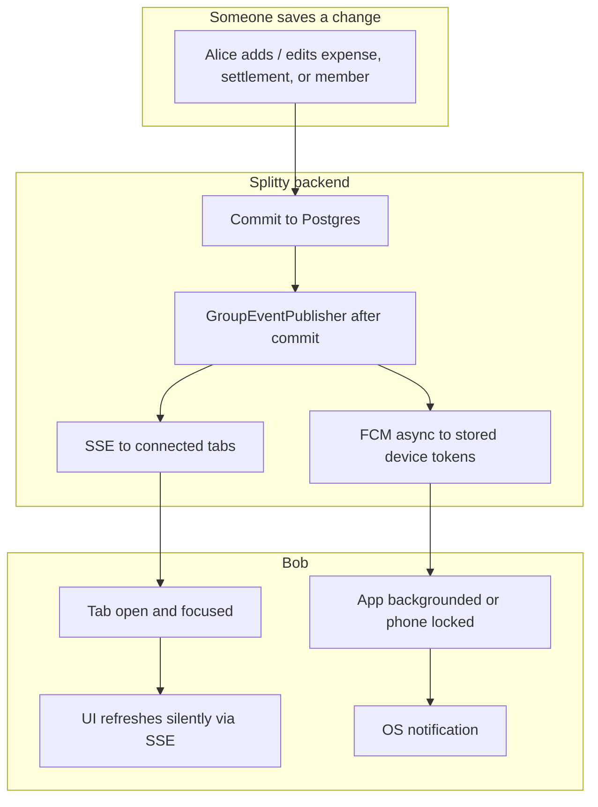
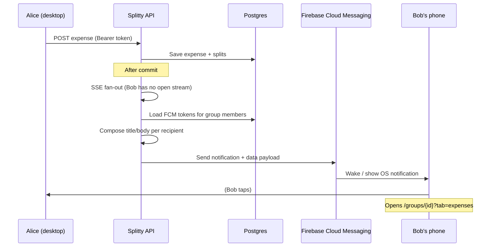
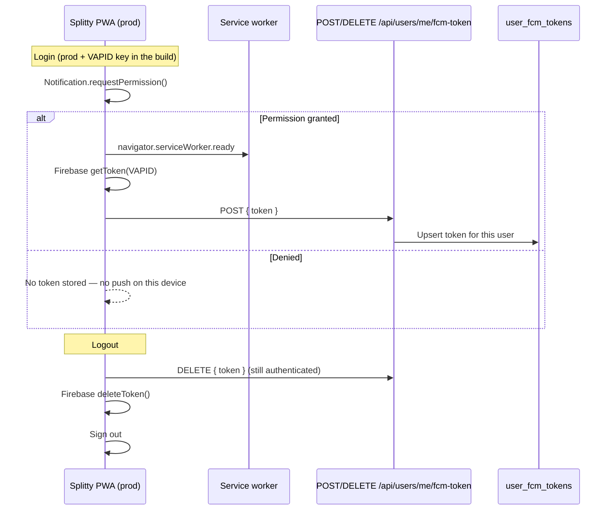
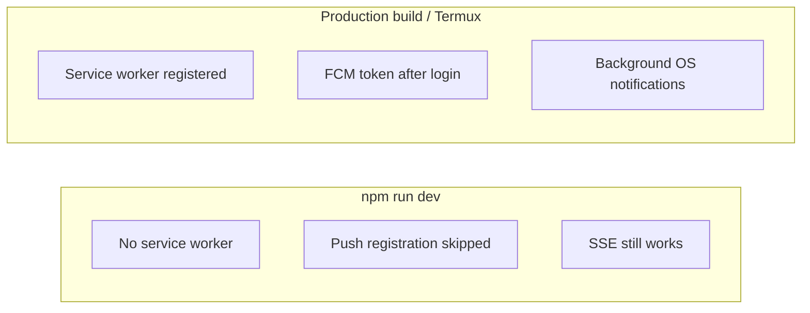

# v1.4.0

| Field | Value |
|-------|-------|
| **Tag** | `v1.4.0` |
| **Range** | `v1.3.1..v1.4.0` |
| **Date** | 2026-08-28 |
| **Public URL** | https://splitty.shashankdev.com |
| **Deploy** | `~/splitty/deploy.sh v1.4.0` then `~/splitty/start-all.sh` |

---

## Release title

**Splitty v1.4.0 — Push notifications when Splitty is in the background**

---

## Release notes

Feature release for **Splitty**. When someone else changes a group you are in, you can get an **OS notification** even if Splitty is in the background or your phone is locked. Open tabs still use live SSE updates (v1.3.0) instead of a toast for every change.

Also includes the iOS Safari horizontal-scroll fix that landed after v1.3.1.

### What you will notice

- After you log in on **production** (HTTPS PWA / installed app), the browser asks to **allow notifications**.
- If Alice adds an expense while Bob’s phone is locked (and Bob previously allowed notifications), Bob should see a banner such as:
  - **Title:** Goa trip
  - **Body:** Alice added Dinner · ₹1,240
- Tapping the notification opens that group’s **Expenses** tab.
- Logging out unregisters this device so you stop getting pushes for that account.

Push is **production-only**. `npm run dev` on localhost never registers a service worker or FCM token — that is intentional.

---

### How delivery works (foreground vs background)

Two channels share the same group-change event. SSE is for an open tab. FCM is for a device that is not looking at Splitty.



**Rule of thumb**

| Bob’s state | What he sees |
|-------------|--------------|
| Splitty tab open and connected | List/balances update in place. No OS banner (SSE is enough). |
| Tab in background, PWA closed, or phone locked | OS notification, if he allowed permission and a token is stored. |
| Never logged in on that phone after this deploy | No token → no push. |

---

### End-to-end: Alice on web, Bob’s phone locked



---

### Device token lifecycle

A user can have **more than one device**. The same physical token is unique: if someone else logs in on a shared phone, the token is **reassigned** to the new user.



**Dev vs prod**



---

### Notification copy (examples)

Title is usually the **group name**. Body uses **You** when the recipient is the actor, payer, or payee.

| Event | Example title | Example body |
|-------|---------------|--------------|
| Expense added | Goa trip | Alice added Dinner · ₹1,240 |
| Expense updated | Goa trip | You updated Dinner · ₹1,400 |
| Expense deleted | Goa trip | Alice removed an expense |
| Settlement | Goa trip | You paid Bob ₹500 |
| Member added | Goa trip | Alice added Priya to the group |
| Group renamed | Splitty | Alice renamed the group to Goa trip |
| Added to a group | Splitty | Alice added you to Goa trip |

Creating a group does **not** notify only the creator (no self-push for `GROUP_CREATED` when they are the only member).

---

### Fixes (also in this tag)

- **iOS Safari:** stop sideways page scroll from overflowing dialogs, flex rows, and avatar stacks (`overflow-x: clip`, dialog width, `min-w-0` / truncate).

---

### API

OpenAPI updated; frontend client regenerated.

#### `POST /api/users/me/fcm-token`

**Auth:** `Authorization: Bearer <firebase-id-token>`

Registers (or reassigns) this device token for the current user.

```json
{ "token": "fcm-device-token-example" }
```

**Response:** `204` empty body  
**Errors:** `400` blank token · `401` unauthorized

#### `DELETE /api/users/me/fcm-token`

**Auth:** `Authorization: Bearer <firebase-id-token>`

Stops push for this token after logout. No-op if the token is not stored.

```json
{ "token": "fcm-device-token-example" }
```

**Response:** `204` empty body  
**Errors:** `400` blank token · `401` unauthorized

FCM payload (not returned by REST): notification title/body plus data `groupId`, `type`, `entityId`, `url`. No secrets in the payload. Invalid / unregistered tokens are deleted automatically.

---

### Infrastructure

- Flyway **`V2__user_fcm_tokens.sql`**: `user_fcm_tokens` (`user_id`, unique `token`). Applied on first backend start after this deploy.
- `FirebaseMessaging` bean; async send from `GroupEventPublisher` (`@EnableAsync`). No-op when `firebase.mock=true`.
- GitHub secret **`VITE_FIREBASE_VAPID_KEY`** baked into the production frontend (Web Push certificate in Firebase Console → Cloud Messaging).
- CI / Release workflows pass the VAPID key into `npm run build`.

---

### Platforms

| Platform | Push support |
|----------|----------------|
| **Android Chrome** (site or installed PWA) | Primary path. Allow notifications after login. |
| **iOS Safari** 16.4+ | Only after **Share → Add to Home Screen**. Chrome on iOS cannot do web push. |
| Desktop Chrome (prod HTTPS) | Works if permission is granted; still skipped in Vite dev. |

---

### Deploy (Termux)

```bash
~/splitty/deploy.sh v1.4.0
~/splitty/start-all.sh
```

On first start, confirm Flyway created the tokens table:

```bash
psql -U u0_a369 -d expensesplit -c "\dt"
```

You should see `user_fcm_tokens`. Then sign up again (if Auth/DB were wiped), log in on the phone, **Allow** notifications, background the app, and add an expense from another account.

---

### Known limitations

- Equal splits only (no custom or percentage splits yet)
- Email-based member lookup only
- Single-server Termux hosting (personal/demo scale)
- No email/SMS fallback, mute-per-group, quiet hours, or “settle from the notification” actions
- Local `npm run dev` does not register push (production HTTPS + service worker required)

---

## GitHub Release (paste)

Use the **Release title** above as the GitHub release title. Use the **Release notes** sections below the horizontal rule as the release description (from "Feature release..." through "Known limitations"). Mermaid diagrams render on GitHub.
